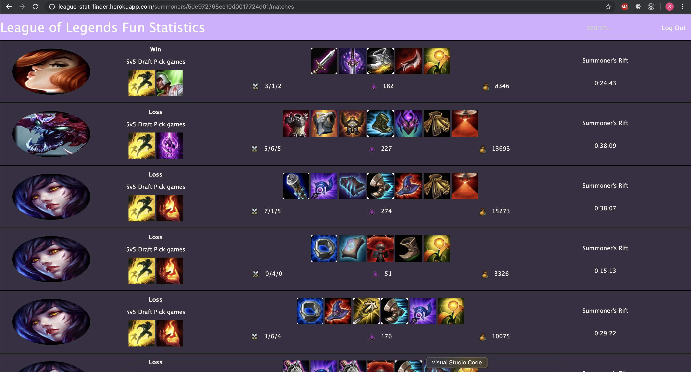
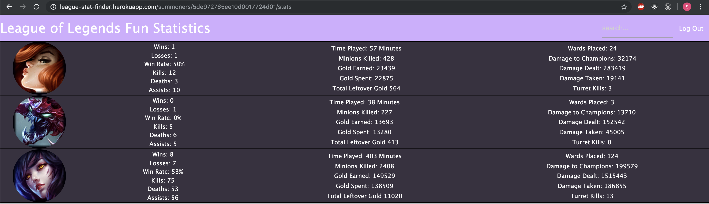

# League Stat Finder
League Stat Finder is a web application that allows users to view match histories and cumulative statistics for League of Legends players ("Summoners"). League of Legends is a computer game where Summoners compete on a five against five basis. Summoners are able to select any one of 146 different characters ("Champions") for each game they play. The application will display relevant results of each game that a Summoner has played in recent history, and will also display the statistics of the matches that each Summoner played as each Champion across all matches saved in the database.

## Technologies Used
- NodeJS
- Express
- EJS
- Fetch and Request for API requests
- Google Oauth with Passport
- MongoDB hosted on mongoDB with Mongoose for queries and updates
- Heroku for web deployment

## Getting Started
Please go to the deployed game at https://league-stat-finder.herokuapp.com/

Once logged in with Google, you will want to look up some players using the search in the nav bar. Here are some summoners you may want to look up:

- TeamSMagnificent (the creator of this application)
- Muffincake10 (a dear friend of the creator)
- Imaqtpie (a famous player)

## Next Steps
The application is currently limited to looking up 19 matches for each Summoner during the initial save. This is due to the API limits currently set by the publisher of League of Legends. If the request limit is increased, the hope is to save 100 matches for each player.

A new page within the match history page that will provide the details of the match for every Summoner in that game.

Summoner Champion specific Champion match up rates